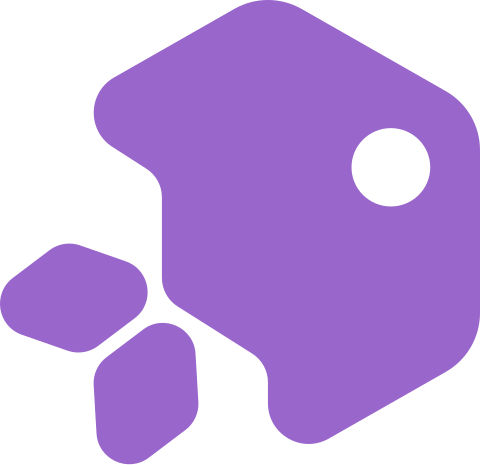

  

<h1 align="center">
  OreoWallet-mono
</h1>

  A repository maintains backend/server-side components that power OreoWallet.

## Introduction

There are 4 types wallet for privacy blockchain like IronFish.

- Type1: Cex wallet, fully-custodial wallet.
- Type2: PrivateKey is safely saved locally while viewkey is uploaded to a backend server for better experience. Transactions are signed locally while transaction decryption and utxos-indexing rely on customsized remote server.
- Type3: Both transaction decryption and creation are performed locally while transaction fetching/broadcasting rely on a public remote rpc like metamask.
- Type4: A wallet embedded with a full node, syncs blocks/transactions with P2P network directly.

OreoWallet aims to build an easy-to-use Type2 extension wallet for Ironfish blockchain. To make OreoWallet easy to use, we need server-side transaction indexing, quick-scanning and fast proof generation, and this repo maintains necessary components mentioned above. 

## Features

| Feature                  | Status |
| ------------------------ | ------ |
| Account creation/import  | ✅      |
| IRON native token        | ✅      |
| User created asset       | ✅      |
| Orescriptions NFT        | ✅      |
| Dapp provider            | ✅      |
| Local data provider      | ✅      |
| Local prover             | ✅      |
| Privacy on routing layer | ✅      |
| Quick scan               | ✅      |
| ...                      | ...    |

## Project structure
<pre>
OreoWallet
├── crates/server: OreoWallet data provider, stores viewkey in db and handles api service
├── crates/prover: OreoWallet prover, generate proof for IronFish transaction
├── crates/scanner: OreoWallet scanner, quick scanning service
├── crates/dworker: OreoWallet worker, running decryption taskes  
</pre>
