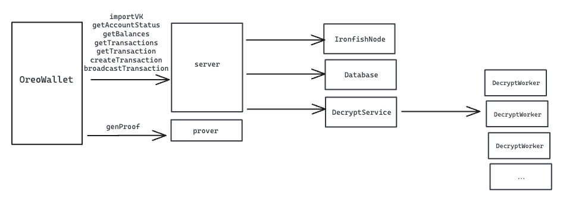

## 1. Overview

This repo consists of `chain_loader`, `dservice`, `dworker`, `server` and `prover`, is the core service of `OreoWallet`.

### 1.1 crates/server
Core service stores imported viewKeys from users and serves as data provider of OreoWallet.

### 1.2 crates/prover
Standalone service to generate zk proof for user transactions, serves as prover of OreoWallet.

### 1.3 crates/dservice
Quickscan server to schedule decryption tasks among all connected dworkers.

### 1.4 crates/dworker
Decryption worker connects to dservice and handles decryption tasks from dservice.

### 1.5 crates/chain_loader
A tool to fetch blocks from rpc and save in local db for better performance during dservice getBlocks.

## 2. Guide-level explanation

